<div align="center">

<!-- ANIMATED HEADER — VENOM TYPE -->


<!-- TERMINAL TYPING SVG -->


<br/>

<!-- SOCIAL BADGES -->
[](https://www.linkedin.com/in/abhinav1506/)&nbsp;
[](https://x.com/abhinavvvv1509)&nbsp;
[](mailto:abhinav.s150601@gmail.com)&nbsp;
[](https://portfoliowebsite-a1dca.web.app/)&nbsp;
[](https://wa.me/917565893606)&nbsp;


</div>


---

## 🧠 `cat about_me.json`

```json
{
  "name"        : "Abhinav Saxena",
  "role"        : "Software Engineer",
  "location"    : "India 🇮🇳",
  "now_building": "🏆 Bounty Platform for Developers & Students",
  "learning"    : ["Advanced Django", "AWS Services", "React Performance Optimization"],
  "open_to"     : "Full-Stack Collaborations",
  "superpowers" : ["Full-Stack Web Dev", "React", "Django", "Node.js", "Cloud Infra"],
  "portfolio"   : "https://portfoliowebsite-a1dca.web.app/",
  "late_night"  : "git commit -m 'still debugging at 3 AM' 🌙",
  "status"      : "Building • Shipping • Iterating ⚡"
}
```

---

## 🚀 Current Mission

```
╔══════════════════════════════════════════════════════════════════╗
║  🏗️  Building a Bounty Platform for Developers & Students       ║
║  ⚡  Optimising React components for performance & scalability   ║
║  ☁️  Integrating AWS services with Django backend                ║
║  🤝  Open to collaborate on exciting full-stack projects         ║
╚══════════════════════════════════════════════════════════════════╝
```

---

## 🛠️ Tech Arsenal

<div align="center">

### ⚙️ Languages


### 🎨 Frontend


### 🔧 Backend


### 🗄️ Databases


### ☁️ DevOps & Cloud


### 🔨 Tools


</div>

---

## 📊 GitHub Analytics

<div align="center">


<br/><br/>


<br/><br/>


</div>

---

## 🏆 GitHub Trophies

<div align="center">

</div>

---

## 🐍 Watch My Contributions Get Eaten

<picture>
  <source media="(prefers-color-scheme: dark)" srcset="https://raw.githubusercontent.com/abozanona/abozanona/output/pacman-contribution-graph-dark.svg">
  <source media="(prefers-color-scheme: light)" srcset="https://raw.githubusercontent.com/abozanona/abozanona/output/pacman-contribution-graph.svg">
  
</picture>

<div align="center">
  
</div>

---

## 💡 My Engineering Philosophy

<div align="center">

> *"First, solve the problem. Then, write the code."* — John Johnson

```
  📐 Clean Code  ──►  📦 Scalable Systems  ──►  🚀 Impactful Products
       ↑                                                  │
       └──────────────────  ♻️ Iterate  ◄─────────────────┘
```

| Principle | Practice |
|-----------|----------|
| 🔍 Readable over clever | Code is read 10× more than written |
| 🧪 Test early, test often | Bugs found late cost 10× more |
| 📦 Ship small, learn fast | MVPs beat over-engineered specs |
| ☁️ Build for scale | Design systems, not just features |

</div>

---

## 📬 Let's Build Something Great

<div align="center">

[](https://www.linkedin.com/in/abhinav1506/)&nbsp;
[](mailto:abhinav.s150601@gmail.com)&nbsp;
[](https://portfoliowebsite-a1dca.web.app/)&nbsp;
[](https://wa.me/917565893606)

<br/>

[](https://www.buymeacoffee.com/chamidudili)

<br/><br/>


*⚡ Crafted with passion by [Abhinav Saxena](https://portfoliowebsite-a1dca.web.app/) · Always open to exciting opportunities · Let's connect!*

</div>
